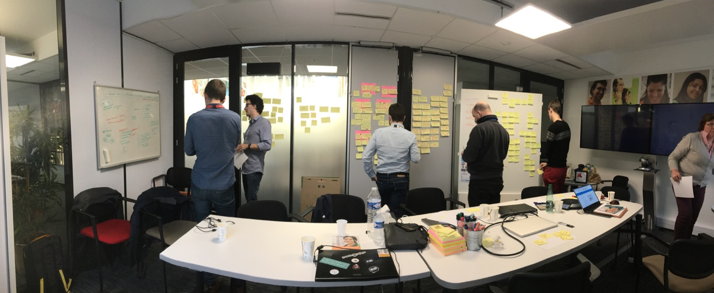
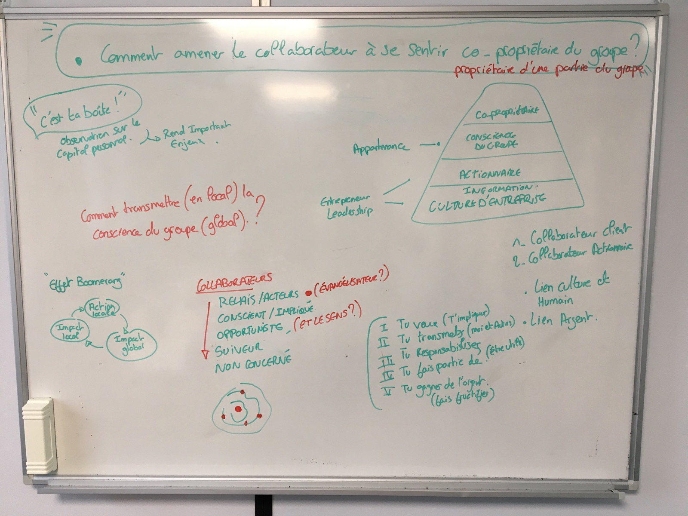

# Day 1 - Comprendre

_La toute première journée n'est pas destinée à apporter des solutions. C'est contre naturel très souvent, mais très efficient. En effet, avant même de chercher des solutions, **il faut savoir poser les bonnes questions**, définir les priorités._

## Aligner les participants sur la connaissance du sujet

_Certains présents n'était pas du tout au courant du fonctionnement de l'actionnariat ce qui était une très bonne chose car il est toujours très utile d'avoir un regard extérieur, forçant ainsi les experts à expliquer autrement quelque chose qui pour eux est évident._

L'actionnariat est un moyen de lier les collaborateurs à Adeo, et non pas une finalité en soi. L'objectif est de permettre une prise de conscience de l'aspect global et mondial d'Adeo. Souvent les collaborateurs on une conscience locale de leur BU géographique mais il est très difficile qu'ils se sentent appartenir à un groupe mondial ou d'autres BU dans d'autres pays impactent également sur leur condition en tant que collaborateur et au quotidien.

> ### c'est ma boîte !

C'est cette réaction qui est attendue de la part du collaborateur, qu'il soit engagé comme si c'était son entreprise. **Demain, 107 000 collaborateurs, tout autant de leaders Adeo**. Ce sentiment peut être obtenu en partie grâce au fait qu'il détient un % de la société. L'actionnariat semble être un complément parfait aux valeurs d'entreprise très familiales.

### Comment transmettre en local la conscience du groupe globale ?

C'est l'une des sous-questions qui émergent et à laquelle nous tentons de répondre durant ce sprint. En effet, le collaborateur produit des actions locales, il ressent les effet localement. Mais comment pourrait-on lui faire ressentir les effet globaux de ses actions locales, et dans l'autre sens les effets sur son quotidien des actions locales d'un autre pays, d'une autre BU ?

#### L'effet Boomerang : Action locale &gt; Impact globale &gt; Impact locale &gt; Action locale, etc...

## Les collaborateurs actionnaires

Nous détectons plusieurs grandes familles de collaborateurs actionnaires :

* Non concernés
* Suiveurs
* Opportunistes _\(n'a pas le sens derrière son actionnariat\)_
* Conscient / Impliqué
* Relai / Acteur _\(évangélisateur\)_

Chacune de ces familles a un impact différente sur la propagation des informations. Il nous convient dans ce sprint de détecter à qui nous nous adressons partant du principe simple **qu'il faut commencer par quelqu'un et qu'il est important de savoir avec précision qui**. Il semblerait que **le suiveur et opportuniste** soient les plus pertinents, simplement du fait qu'ils sont actionnaires mais qu'ils n'ont pas le sens et la connaissance, c'est donc à eux que nous allons proposer des solutions. Pour ce qui est des conscients, ils sont influencés par les acteurs, et eux, disposent déjà du nécessaire en terme de connaissance et moyens pour faire leur boulot.

## Les actions des collaborateurs

* Tu veux \(t'impliquer\)
* Tu transmets \(moi et les autres\)
* Tu responsabilises
* Tu fais partie de \(se sentir utile\)
* Tu gagnes de l'argent \(fais fructifier\)

En partant de ces différentes actions, nous avons pu créer une pyramide des besoins type "Maslow" spécialement pour Adeo :

| Sentiment d'être propriétaire d'une partie du groupe | Sens et une estime de soi |
| :--- | :--- |
| Conscience du groupe | Sentiment d'appartenance |
| **Actionnaire** | **Sentiment de leadership, entrepreneur** |
| Information & culture d'entreprise | Base nécessaire, terrain fertile |

On passe du "collaborateur client au "collaborateur actionnaire acteur".

## Faire émerger les bonnes questions

Suite à toutes ces informations, nous pouvons grâce à l'exercice des "**How might we**" faire émerger les bonnes questions. Nous partons des problèmes détectés, et nous reformulons en opportunités pour créer la bonne base pour émerger des solutions le lendemain.

* Comment amener le collaborateur à **avoir envie** de s'informer ?
* Comment faire pour améliorer la connaissance **des actions du groupe** ?
* Comment faire pour **vulgariser** l'information ?
* Comment **transmettre le sens** à tous ?

## Remarque du facilitateur

Il semble évident que Adeo libère de plus en plus de solutions aux collaborateurs pour s'informer : intranet, mail, applications diverses, etc... Cependant ce qui remonte ici est une priorité d'organiser l'information et la connaissance, d'y structurer et d'y adapter au collaborateur, au contexte de lecture et d'apprentissage, etc... **Il manque en interne à Adeo une personne experte et dédiée à l'architecture d'information et au content management.** Avec une échelle si importante, un groupe comme Adeo doit dédier une équipe propre à communiquer en interne. En effet, la technologie et le numérique est un grans soutien, cependant, c'est un moyen et non une finalité, il y a toujours besoin d'humains pour de la curation, créer des discussions et réguler la connaissance.

