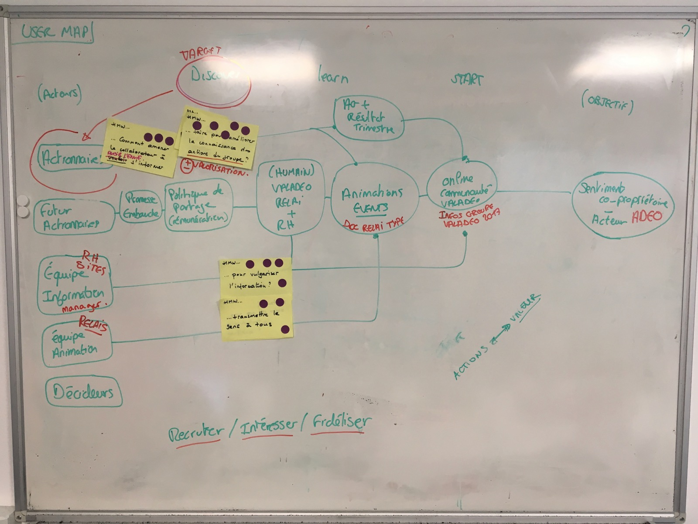

# Day 2 - Diverger

_La seconde journée est destinée à développer des solutions pour répondre aux questions prioritaires émergées la veille. Elle commence par des démos d'éléments de solutions existantes ailleurs, pour inspirer les créations de l'après-midi. En effet, rien n'est plus contre-productif que de réinventer la roue._

Ensuite, l'après-midi, chaque membre de l'équipe travail sur son propre projet individuel. Après 1 jour et demi de groupe, il est maintenant temps d'offrir à chacun l'opportunité de s'exprimer pleinement. En effet, c'est créer encore plus de diversité et de richesse que de rendre un travail groupe individuel, et ensuite, de regrouper à nouveau les créations pour en extraire ce dont on aura besoin pour la construction du prototype de solution validé par tous les experts.

## Le parcours collaborateurs

Avant que chacun s'exprime, il faut s'assurer que tout le monde soit aligné sur la même partie de problématique : en effet, nous ne pouvons pas durant un sprint traiter toute l'étendu d'un problème mais plutôt détecter la première étape, la priorité d'action qui permettra d'enclencher les étapes suivantes par la suite.

Pour se faire, nous représentons le parcours collaborateurs. L'objectif est en sortie, et en entrée les acteurs de ce parcours.

### Les acteurs

* Les collaborateurs actionnaires
* Les futurs actionnaires
* Les équipes d'informations \(RH sites, Managers\)
* Les équipes animation \(Relais\)
* Les décideurs

### L'objectif

Sentiment de propriétaire d'une partie du groupe / Collaborateur acteur de **son** entreprise.

### Etapes du parcours

#### Phase de découverte

* Promesse d'embauche
* Politique de partage
* Valadeo relai + RH actions

#### phase d'apprentissage

* Animations d'évènements
* Ag + résultats trimestre
* Online communauté Valadeo \(infos groupe 2017\)

#### phase d'action

Le collaborateur devient relais, créateur de contenu et acteur du groupe.

## Champ d'action du sprint

Nous détectons avec les questions prioritaires émergées que **notre champ d'action se trouve au niveau de la découverte**. Il manque dans cette zone pour les collaborateurs suiveurs et non concernés des moyens d'accéder à l'information ainsi qu'un certain type d'information et un "outil" pour diffuser ces informations, rentrer en contact avec le collaborateur.

Voilà toute l'inspiration nécessaire pour que chaque membre du groupe puisse travailler sur sa propre expression de solution à ce manque. Les différents axes de création se portent sur :

* Trouver les bon types de médias
* Créer une bonne structure d'information
* Détecter les points de contacts, la fréquence
* Choisir les bons mots, le bon discours adapté à la cible
* Etc...

