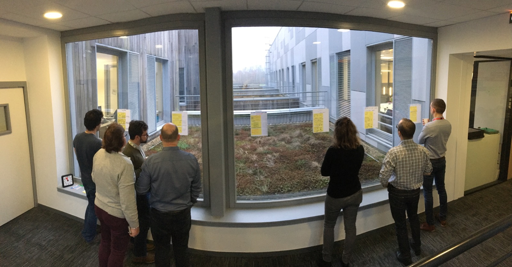
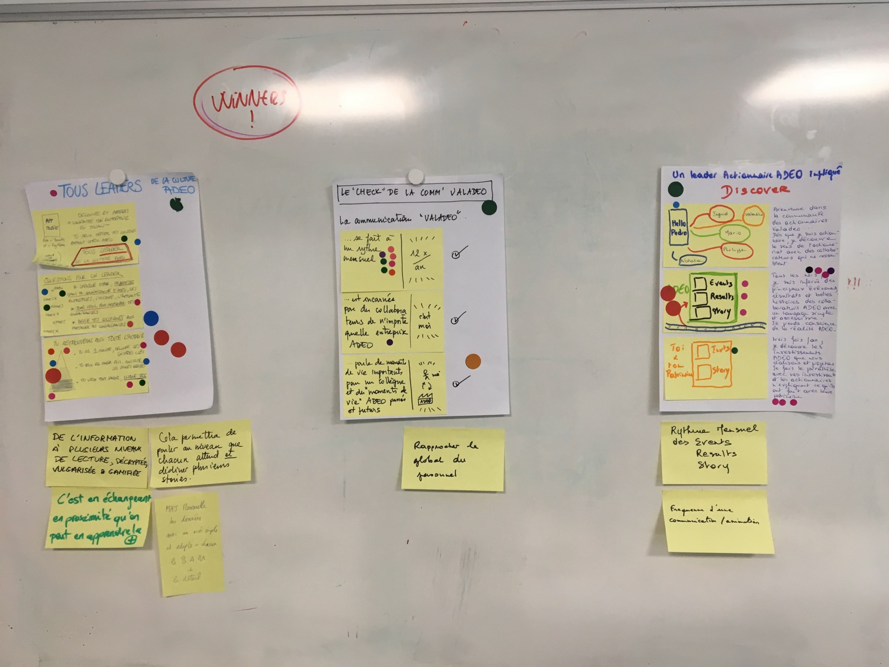
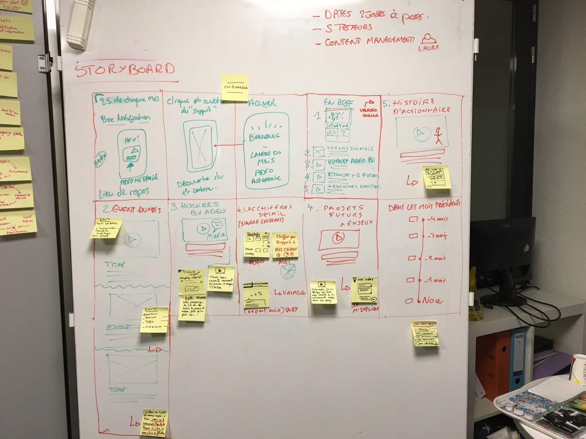

# Day 3 - Converger

_Nous nous retrouvons pour découvrir les travaux de chacun. Cette phase dure toute la matinée et est destinée à apporter un maximum d'informations venant des experts du groupe pour nourrir la décision de Brigitte, qui est la responsable de la continuité de notre projet. C'est le moment de DECIDER en groupe sans pour autant débattre, grâce aux outils type ZEN VOTING._

3 des projets sont conservé suite à décision. La richesse est qu'ils sont complémentaires, reprenant également beaucoup des propositions des autres projets.

Les points important à intégrer dans le prototype qui remontent :

* Gérer un rythme d'information mensuellement, créer un rendez-vous, un rituel de l'information très synthétique.
* Gérer l'information suivant plusieurs niveaux de lecture : niveau synthèse, niveau contenu léger et ensuite possibilité de renvoyer vers un contenu plus fourni.
* Une vue générale et très synthétique, pour que en 1 minute on puisse avoir une découverte de l'information du mois.

## Storyboard

Tout le travail de l'après-midi consiste à regrouper toutes les idées validées dans un storyboard qui va raconter l'histoire de l'expérience proposée dans notre prototype. Je rappelle que le prototype est une simulation d'expérience réelle, que les testeurs bien sélectionnés aient l'impression de réellement consommer un produit/service, alors que derrière rien n'est encore réellement en place. C'est le meilleur moyen pour valider/invalider l'orientation prise avant de se lancer dans un développement plus long et couteux. **C'est une manière efficace d'optimiser des actions projets et de limiter les risques de dépenses inutiles.**

Dans un storyboard, il y toujours une mise en contexte, l'histoire que l'on raconte au testeur lorsqu'il arrive. Ici, c'est une notification qu'il reçoit, une fois dans le mois dans un environnement de détente et repos.

Ensuite, il ouvre le contenu en question et découvre un accueil chaleureux. La première vue regroupe de manière synthétique les chiffres du mois en bref, les events du mois, une histoire Adeo BU, Un projet futur et une histoire d'actionnaire. **C'est les types de contenu à partager aux collaborateurs tous les mois pour leur permettre de prendre conscience du groupe et de se sentir intégrés**. Du moins, c'est l'hypothèse à valider durant les tests.

Les autres vues montrent en détail les différentes partie de ce sommaire. A chaque fois, il est important de partager un contenu sous format texte synthétique, format vidéo, avec l'humain mis en avant.

Ce storyboard est le nécessaire à notre équipe pour attaquer la 4ème journée avec TOUT le nécessaire regroupé, priorisé et clarifié. Surtout que la journée 4 arrive 1 mois après cette journée.

