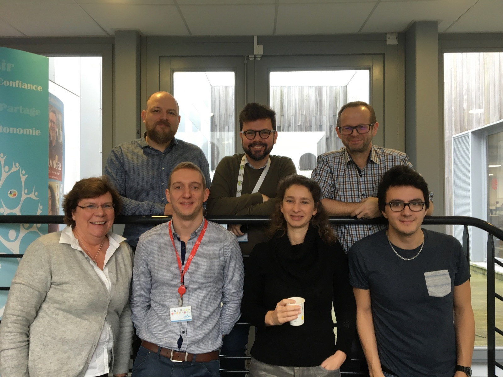
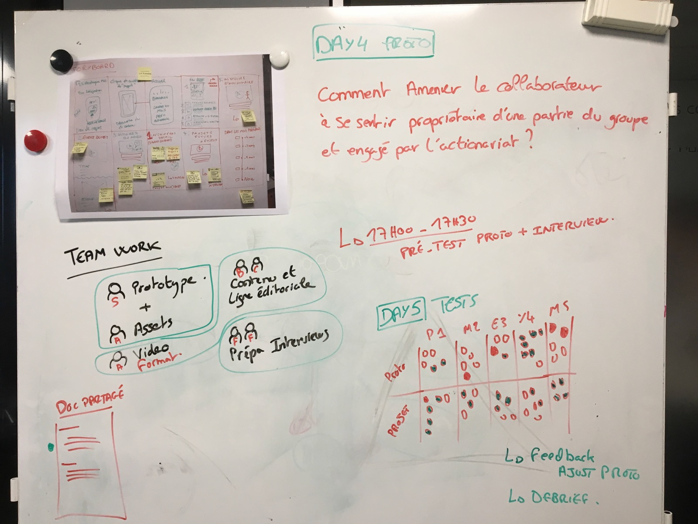

# Day 4 - Prototyper

Cette journée arrive 1 mois après la journée 3, ce qui n'est pas idéal. Cependant, avec le storyboard de qualité que nous avons produit, il suffit de 1h pour remettre toute l'équipe dans le bain et en contexte.

## Travail de groupe

C'est un mode de travail très agile pour cette journée : fini le travail collectif, c'est une répartition en différents pôles. Tout le monde travail sur sa partie, **mais reste ensemble pour limiter les temps de latences** quand il y a des questions ou des validations à apporter.

**2 personnes sur la réalisation du prototype, 2 sur le contenu et la ligne éditoriale, 1 à la ressource vidéo si besoin de créer pour le prototype et 2 personnes sur la préparation des interviews le lendemain.**

La priorité est sur le contenu, qui peut nourrir le prototype. Les avancés du prototype permettent également une rédaction du script d'interview cohérente.

Tout le travail s'effectue sur un document partagé, pour la syncro et surtout ne pas perdre de temps pour la partie technique. Tout le monde a bien le storyboard en tête et la journée se termine sur un test entre nous du prototype, pour valider que nous sommes fin prêt pour la grande journée de test du lendemain.

