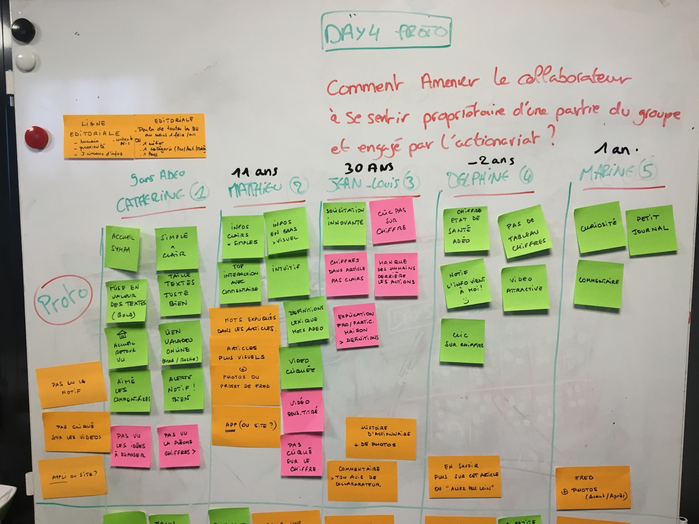
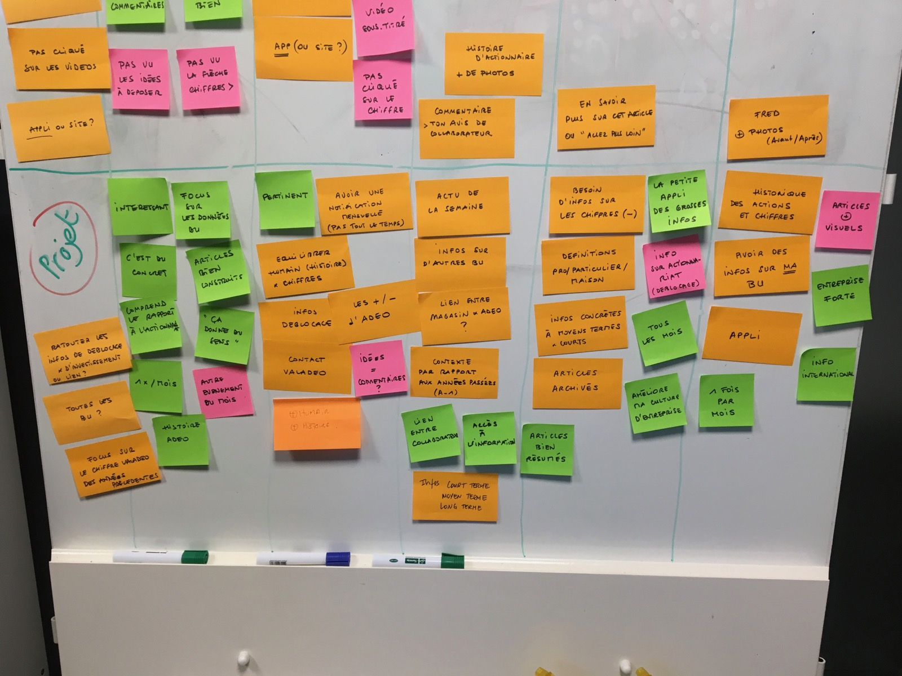

# Day 5  - Tester

_C'est la journée la plus important du Design sprint. En effet, TOUT est structuré pour construire la journée de test idéale. Ce n'est que à ce moment là que nous avons un prototype de produit/service **concret** dont les testeurs font **directement l'expérience en contexte.** C'est le meilleur moyen d'apprendre de ses hypothèses, et de valider ou invalider un chemin à prendre._

_Les retours des interviews sont les éléments les plus important et les plus solide pour décider de la suite du développement du produit/service._

5 sessions de test sont prévus sur la journée, **c'est la quantité nécessaire et suffisante pour récupérer 80% des retours qualitatifs utiles à apprendre sur un projet.** En effet, augmenter la durée et le nombre de tests ne ferait gagner que peu d'apprentissage pour une perte de temps et d'argent non négligeable.

Chaque session est organisée comme une discussion, conduite par le facilitateur ou un expert interview. Il faut que le testeur soit confortablement introduit en contexte, qu'il ne sente pas qu'il est testé lui, mais bien qu'il est le parfait intervenant pour aider le groupe de travail.

Dans une seconde salle, le reste de l'équipe récupère les différents feedback et en structure une synthèse des retours. A la fin de la journée, **c'est une grosse synthèse générale qui est faite**, et la marche à suivre est décidée en groupe et validée par Brigitte.

Le vert représente les retours positifs, les orange les retours neutres et les roses les retours négatifs. Sur une première partie du tableau, les retours concernant le prototype en lui-même, la forme, et sur la seconde partie les retours concernant le fond, le projet en lui-même. Comme nous pouvons le voir rapidement, il y a peu de retours critiques sur le projet, ce qui est très bien pour le projet !

## Synthèse des retours utilisateurs

il est maintenant temps de détecter les doublons, les motifs qui font remonter une information importante à ne surtout pas manquer. En effet, les informations que font remonter 3 testeurs au moins est l'indication qu'il y a une priorité.

Ainsi, suite au tests, **nous pouvons valider globalement que le projet va dans le bon sens ! C'est une réussite !** Il faut cependant bien peaufiner certains points, à mettre à jour dans le prototype :

* Le système de notification unique fonctionne très bien
* Le rythme mensuel est validé aussi
* Le format mobile semble idéal
* Le format du contenu est pertinent : la longueur est bonne, mais créer plus de contraste. Plus de photos. Prévoir 3 niveaux de lecture, et bien lier les sujet à l'humains, raconter des histoires.
* Les chiffres représentent bien la santé de Adeo, ce qui importe le plus aux collaborateurs.
* Le fait que l'interaction soit possible, sous forme de commentaire fonctionne et rapproche.

**Les différents types de contenu :**

* Ce qui me concerne
* Ce qui est lié aux autre BU
* En rapport avec ma BU

Le vocabulaire est à vulgariser pour certains niveaux de lecture. De plus, pouvoir accéder à l'historique des autres mois est important.

intégrer des liens vers Valadeo et d'autres contenus online est pertinent. Ce contenu de découverte permet d'orienter le collaborateur s'il veut aller plus loin sans effort.

Les différentes dimensions de prise de conscience du collaborateur sont les suivante :

* Passé, présent et futur, via des évènements liés aux humains du groupe
* Voir des autres collaborateurs, découvrir de belles histoire touche les collaborateurs
* Montrer de temps en temps des infos de leur BU est important, tout en l'intégrant dans un rapport de proximité avec le groupe et les autres BU dans le monde

## Notre produit/service dans le contexte Adeo

D'autres prises de conscience prioritaires remontent durant notre debrief de fin de sprint, **marquant non pas la fin mais bien le début du projet !**

**Il est nécessaire de "réduire le bruit" autour du produit que l'on va mettre en place.** En effet, actuellement les collaborateurs sont littéralement noyés dans une mer d'informations : mails, notifications diverses, solicitations sur les écrans et médias du groupe, autres applications... **Notre service est une synthèse, une proposition de routine d'information 1 fois par mois.** C'est cette "porte d'entrée" vers l'information actionnaire qui va permettre de rediriger le collaborateur vers les autres sources d'informations. Avec une seule notification par mois, si l'on désactive toutes les autres "prises de contact", le collaborateur n'est plus noyé et il se sent accompagné régulièrement pour prendre conscience de son entreprise.

**Notre produit PARLE aux collaborateurs**, les autres sources de contenu deviennent A DISPOSITION mais ne doivent plus PARLER autant. En effet, trop de contenu non priorisé, c'est comme aucun contenu, les collaborateurs ne s'informent plus.

Egalement, important de trouver la bonne manière de nommer ce produit : est-ce que c'est Valadeo, simplement Adeo ou Adeo actionnaires... Multiplier les noms de "médias" du groupe est un risque que le collaborateur ne comprenne plus rien. **Le plus simple serait certainement de parler de ADEO et de définir que c'est la partie actionnariat.**

Il faudra prévoir toute une communication pour introduire et présenter ce produit/service, comme il serait fait pour une start-up introduire son produit sur le marché. Un Onboarding est aussi à prévoir.

